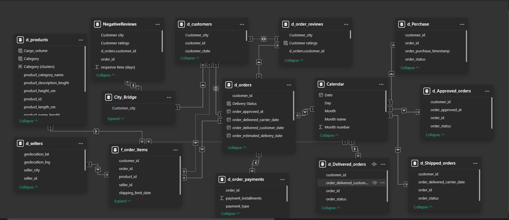

# Trade & Logistics: End-to-End Business Analysis

A comprehensive Power BI project analyzing the full lifecycle of a retail business — from sales and logistics to payments and customer satisfaction.

## 📌 Project Overview

The goal of this project was to transform raw transactional data into a strategic tool for decision-making. I developed a 4-page interactive dashboard that covers key business verticals, allowing stakeholders to identify bottlenecks and growth opportunities.

### Star Schema (12+ tables post-ETL)

**How did I bridge Cities ↔ Orders? 👀**  
**Download PBIX for full DAX + relationships**

### ⚡Key Performance Indicators (KPIs) & Business Insights

Below are the core metrics developed to measure performance and identify growth opportunities.

#### 📊 1. Sales & Revenue Performance

**Sales & Revenue Performance (The "How much?" perspective)**

This dashboard provides a high-level view of the company's financial health, tracking sales performance and market trends from 2016 to 2018.

Key Metrics (KPIs):
 * Total Revenue: 15M
 * Total GMV: €10.77M
 * Average Check: €138
 * Sales Pipeline: 649 Leads / €316K in active deals

Analytical Insights:
 * Growth & Scaling Patterns: The multi-year GMV chart shows a significant transition from early-stage operations in 2016 to aggressive scaling in late 2017. The steady upward trend into 2018 suggests successful market penetration and a sustainable customer acquisition strategy.
 * Revenue Drivers by Category: Sales are heavily concentrated in the top three segments: Home & Furniture (€2.86M), Miscellaneous, and Fashion. While this shows a strong market fit in these niches, it also highlights a potential risk of over-reliance on a few categories.
 * High-Velocity Sales Model: Comparing the total revenue (€15M) with the relatively small active pipeline (€316K) indicates a fast-moving, transactional business model. Sales cycles are likely short, which is typical for a healthy e-commerce or retail environment.
 * Market Positioning: A stable Average Check of €138 suggests the business is firmly positioned in the mid-market segment. This price point indicates a balance between volume and value, appealing to a broad but quality-conscious customer base.

#### 📦 2.  Logistics & Supply Chain Efficiency

**Logistics & Supply Chain Efficiency (The "How fast?" perspective)**

This dashboard analyzes the operational side of the business, focusing on delivery performance, shipping costs, and geographic distribution from 2016 to 2018.

Key Metrics (KPIs):
 * On-time Delivery Rate: 93%
 * AVG Freight Value: €23
 * AVG Processing Time: 12.3 hours
 * AVG Order Cycle Time: 12 days
 * AVG Orders per Shipping Day: 149

Analytical Insights:
 * Delivery Reliability: An On-time Delivery Rate of 93% indicates a very stable logistics network. However, the 12-day Order Cycle Time suggests that while deliveries are predictable, the overall process is relatively slow. There is a clear opportunity to improve the "last-mile" speed to stay competitive.
 * Regional Concentration: The geolocation maps show a high density of both sellers and customers concentrated in the same region (primarily Brazil). This proximity explains the low Average Freight Value of €23, as shipping distances remain mostly regional rather than international.
 * Cargo Volume Profile: The logistics operations are heavily skewed towards Medium and Small-sized cargo, which together make up over 75% of all shipments. There is a strong case for prioritizing negotiations with carriers that specialize in frequent small‑parcel shipments, exploring opportunities to reduce costs through optimized transportation strategies.
 * Shipping Cost Drivers: The Home & Furniture category is the primary driver of logistics activity, accounting for the highest quantity of deliveries (28,930) and the highest total shipping cost (€597,920). Optimizing the packaging or carrier selection for this specific category would have the most significant impact on reducing overall operational expenses.

#### 💳 3. Payment Dynamics & Customer Base Growth

**Payment Dynamics & Customer Base Growth (The "How paid?" perspective)**

This dashboard analyzes the company’s financial ecosystem, focusing on payment efficiency, customer retention, and the scaling of the active user base from 2016 to 2018.

Key Metrics (KPIs):
 * Active Customer Base: 96K
 * Average Items per Order: 1.14
 * Payment Conversion Rate: 98%

Analytical Insights:
 * Aggressive Market Scaling: The Waterfall chart reveals a massive jump in the active customer base between 2016 and 2018. The year 2017 acted as a major turning point, with categories like Health & Beauty and Miscellaneous Services significantly expanding the user footprint. This suggests a successful transition from a niche player to a multi-category retail platform.
 * Payment Method Preferences: The data shows a clear dominance of Credit Cards, accounting for 73.92% of all transactions. However, the significant 19.04% share of Boleto payments highlights the necessity of supporting localized payment methods to capture a larger portion of the Brazilian market.
 * Conversion Stability & Optimization: While the overall payment conversion sits at a healthy 98%, the monthly breakdown shows historical volatility in early 2017 (e.g., 77% in January and 85% in February). The subsequent stabilization to near 100% conversion in 2018 indicates successful technical optimizations in the checkout process or better fraud management.
 * Geographic Concentration: Market activity is highly concentrated in Sao Paulo, which leads the "Top 10 Cities" list with over 15K active customers and €2.12M in total payments. This city alone generates more revenue than the next several cities combined, identifying it as the critical hub for the company’s logistics and marketing efforts.

#### 😊 4. Customer Reviews & Service Quality

**Customer Reviews & Service Quality (The "How happy?" perspective)**

This dashboard evaluates customer satisfaction levels and service responsiveness, providing critical feedback on product quality and post-purchase support.

Key Metrics (KPIs):
 * Average Review Score: 4.09
 * Negative Feedback Ratio: 14.7%
 * Feedback Response Time: 2.6 days

Analytical Insights:
 * Customer Sentiment Distribution: The majority of customers are highly satisfied, with over 77% rating their experience as "Excellent" or "Good." However, the 14.7% Negative Feedback Ratio identifies a significant segment of detractors, which is a key area for service improvement.
 * Non-Correlation Between Response Time and Ratings: A comparative analysis reveals that a longer response time does not automatically lead to more negative feedback. For instance, while Salvador has a longer average wait time than Sao Paulo, it actually reports a lower volume of "Very Poor" ratings. This suggests that customer satisfaction is driven by a complex mix of factors - such as product quality or delivery punctuality - rather than communication speed alone.
 * Stability of Service Quality: The temporal analysis shows consistent performance, with the average review score remaining stable at approximately 4.0 from 2016 through 2018. This indicates that the company maintained its service standards even during periods of rapid growth.
 * Geographic Service Bottlenecks: The mapping of response times exceeding 1.5 days highlights specific regional clusters, particularly in the Southeast. Identifying these areas allows for targeted operational adjustments to balance the workload across support teams.

### 🛠️ Technical Skills & Tools

**Data Modeling & DAX:**

* Developed complex Data Models and authored DAX measures to calculate custom KPIs (e.g., Year-over-Year growth, RFM scores, and moving averages).

**Data Transformation (Power Query):**

* Performed ETL processes to clean and reshape raw data, ensuring high data quality for metrics like Order Fulfillment rate and Delivery Lead Times.

**Advanced Visualizations:**

* Designed interactive reports with advanced filtering, bookmarks, and tooltips to provide deep dives into Category Performance and Customer Geography.

---

**📁 Repository:** Full PBIP project, sample data, demo GIFs

---

**📄 License:**
Code (DAX, Python): MIT License — free to use with attribution  
&nbsp;&nbsp;&nbsp;&nbsp;&nbsp;&nbsp;Text & visuals: CC BY 4.0
